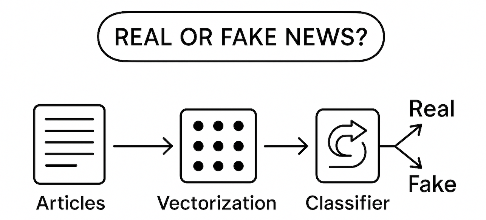

# Misinformation Detection Project

    

## Context
The spread of misinformation, particularly through online platforms, has become a significant challenge in today's digital age. Fake news can influence public opinion, disrupt social harmony, and even impact political outcomes. Detecting misinformation is a critical task in the field of Natural Language Processing (NLP), where machine learning and deep learning techniques are employed to classify news articles as either "fake" or "true."

This project explores various approaches to tackle the problem of misinformation detection using classical machine learning models, deep learning architectures, and state-of-the-art transformer-based models.

---

    

## Motivation
The motivation behind this project stems from the increasing prevalence of fake news and its potential to cause harm. While traditional methods of fact-checking are effective, they are often time-consuming and cannot scale to the volume of information shared online. This project aims to:
- Explore the effectiveness of different NLP techniques for misinformation detection.
- Compare classical machine learning models with modern deep learning and transformer-based approaches.
- Evaluate the generalization capabilities of models on unseen data.
- Demonstrate the potential of zero-shot classification models, which are not explicitly trained for fake news detection, to perform well in this domain.

---

## Project Overview
The project is structured into the following steps:

### 1. Data Preparation
- *Datasets*: The project uses two datasets:
  - Fake.csv: Contains fake news articles.
  - True.csv: Contains true news articles.
- *Preprocessing*:
  - Texts are cleaned by converting to lowercase, removing special characters, and lemmatizing words.
  - Stopwords are removed to reduce noise in the data.

### 2. Exploratory Data Analysis (EDA)
- Analyzed the structure of the datasets, including missing values, duplicate entries, and text lengths.
- Visualized the distribution of classes and subjects in the datasets.

### 3. Text Representation
Various methods were tested to convert textual data into numerical representations:
- *Bag of Words (BoW)*: Counts the frequency of words in the text.
- *TF-IDF*: Weighs words based on their importance in the document relative to the entire dataset.
- *Word2Vec*: Generates dense word embeddings by training on the dataset.
- *BERT*: Uses pre-trained transformer-based embeddings for sentence representation.

### 4. Classical Machine Learning Models
The following models were trained and evaluated:
- Logistic Regression
- Naive Bayes
- Support Vector Machines (SVM)
- Random Forest

### 5. Deep Learning Models
- *LSTM (Long Short-Term Memory)*:
  - Trained on Word2Vec embeddings to capture sequential dependencies in the text.
  - Evaluated on both the training dataset and unseen data.
- *CNN (Convolutional Neural Network)*:
  - Used sequential representations of text with an embedding layer.

### 6. Transformer-Based Models
- *Zero-Shot Classification*:
  - Leveraged the facebook/bart-large-mnli model to classify news articles without explicit training on the fake news dataset.
  - Achieved an accuracy of more than *70%* on unseen data, demonstrating the generalization power of transformer-based models.

---

## Key Results
- *Classical Models*:
  - Logistic Regression and SVM performed well with TF-IDF and BoW representations.
  - Random Forest showed competitive performance but required more computational resources.
- *Deep Learning Models*:
  - LSTM achieved high accuracy on the training dataset and generalized well to unseen data.
  - CNN provided robust results with sequential embeddings.
- *Zero-Shot Classification*:
  - Despite not being trained for fake news detection, the BART-based model achieved a remarkable accuracy of 70% on unseen data, highlighting the versatility of transformer models.

---

## Technologies Used
- *Programming Language*: Python
- *Libraries*:
  - Data Processing: pandas, numpy, nltk, re
  - Machine Learning: scikit-learn
  - Deep Learning: torch, tensorflow, gensim
  - Transformers: transformers (Hugging Face)
  - Visualization: matplotlib, seaborn

---

## How to Run the Project
1. *Clone the Repository*:
   bash
   git clone https://github.com/your-repo/misinformation-detection.git
   cd misinformation-detection
   

2. *Install Dependencies*:
   bash
   pip install -r requirements.txt
   

3. *Run the Main Script*:
   bash
   python main.py
   

4. *View Results*:
   - The results, including model accuracies and classification reports, will be displayed in the terminal.

---

## Future Work
- Incorporate additional datasets to improve model robustness.
- Experiment with other transformer-based models like RoBERTa, DistilBERT, and GPT.
- Implement real-time fake news detection for social media platforms.
- Explore multilingual fake news detection to address misinformation in non-English languages.

---

## Contributors
- *Amine Razig*
- *Mohamed Keteb*

---

## Acknowledgments
We would like to thank the creators of the datasets and the open-source community for providing the tools and resources that made this project possible.